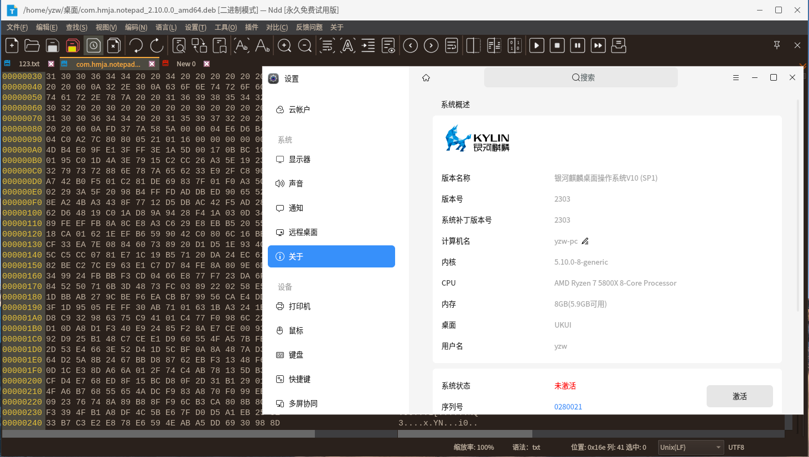
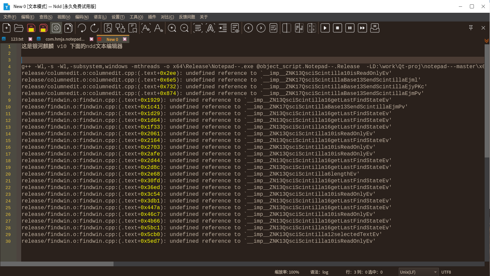
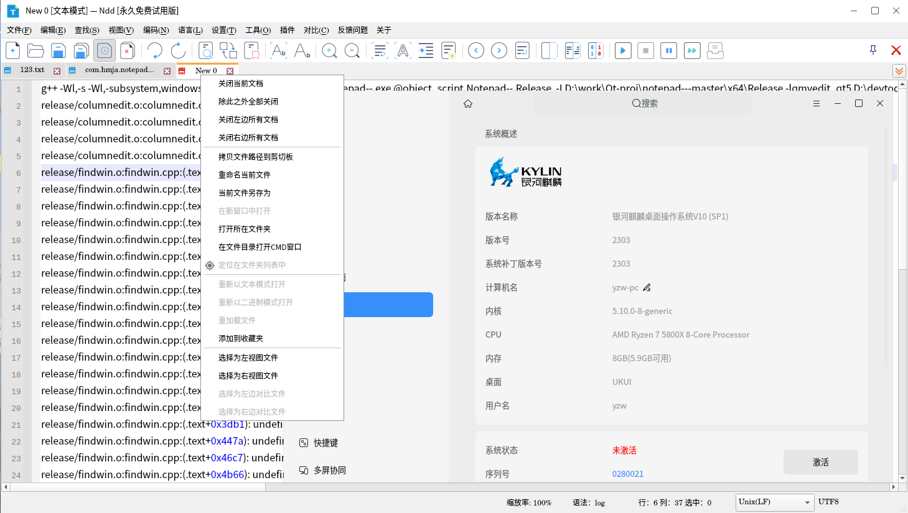

# notepad--

[中文 ](README.md) | [English](README_EN.md)

## 项目简介

Notepad-- 是使用C++编写的轻量级文本编辑器, 简称ndd, 可以支持Window/Mac/Linux操作系统平台。

我们的目标：完成文本编辑类软件的国产可替代，重点在国产Uos/Linux系统、Mac 系统上发展。

对比其它竞品Notepad类软件而言，我们的优势是可以跨平台，支持linux mac操作系统。

 **鉴于某些Notepad竞品作者的不当言论，Notepad--的意义在于：减少一点错误言论，减少一点自以为是。** 

 **Notepad--的目标，致力于国产软件的可替代，专心做软件。**

您可以在这个项目提交bug或反馈问题。

最新版本下载地址：https://gitee.com/cxasm/notepad--/releases/latest

NDD 具备插件编写功能，如果您愿意开发插件，还请提交给我们。

做国人自己的免费编辑器，离不开您的支持，请通过微信捐赠我们。


## 编译

**CMake工具链编译说明:**

- Windows 系统通用构建 - 基于 Batch 脚本进行构建
    
    ```batch
    ;; 将 Batch 脚本复制到项目目录
    copy cmake/make-batch-powershell/windows-msvc-ninja.bat .

    ;; 使用脚本进行构建，它将会询问如何进行构建
    windows-msvc-ninja.bat
    ```

- Windows 系统 VSCode 构建 - 基于 VSCode 配置模板进行调整构建

    ```batch
    ;; 拷贝一份 cmake/vscode/windows-vs-2022-cmake-ninja.json 作为你的 .vscode/settings.json
    ;; 修改配置中的 -DCMAKE_PREFIX_PATH 部分为你的 Qt 路径，或你自行编译的 Qt 路径，
    ;; 例如：
    ;;    "-DCMAKE_PREFIX_PATH=C:\\Qt\\Qt5.14.2\\5.14.2\\msvc2017_64",
    ```

- MacOSX 平台构建方案

    ```shell
    Build with the following configuration:
    1. make macosx-universal 
            通用 MacOSX 平台构建(Debug).
    2. make macosx-universal-release 
            通用 MacOSX 平台构建(Release).
    3. make package 
            通用 MacOSX 平台构建 CPack 打包.

    # 由 CPack 驱动的打包：
    # 将在 build/macosx-universal 目录中产生 dmg 文件
    # 可在 CPack 的生成目录尝试进行手动 macdeployqt 处理
    # 注：目前M1平台使用原生Qt执行此操作会损坏此包，将需要开发者签证
    ```

- 当前的 Linux 平台构建方案

    ```shell
    Build with the following configuration:
    1. make -f linux-universal.mk 
            默认的通用 Linux 平台构建.
    2. make -f linux-debian.mk package 
            通用 Linux 平台的 Debian deb 构建.
    3. make -f linux-appimage.mk package 
            通用 Linux 平台的 Appimage 构建.
    4. make -f linux-uos.mk package 
            独立 Linux 平台的 Uos 构建.
    ```

- Linux 通用构建系列(*仅适合**配合其它打包方案**操作*) - 基于默认的通用 Linux 平台构建.

    ```shell
    # 构建默认的
    make -f linux-universal.mk 
    # 进入构建目录
    cd build/linux-universal
    # 执行 make install 安装到 out 目录，得到一个标准 linux 的目录结构
    make DESTDIR=out install
    ```

- Ubuntu/Debian - 基于通用 Linux 平台的 Debian deb 构建

    ```shell
    # 安装编译环境 
    sudo apt-get install g++ make cmake
    # 安装qt工具和库
    sudo apt-get install qtbase5-dev qt5-qmake qtbase5-dev-tools \
                    libqt5printsupport5 libqt5xmlpatterns5-dev
    # 构建 Linux Debian 通用平台
    make -f linux-debian.mk package

    # 将在 build/linux-debian 目录中产生 deb 文件
    # 其它相关内容将不定期更新说明
    ```

- Linux 跨发行版构建 Appimage - 基于通用 Linux 平台的 Appimage 构建

    ```shell
    # 在支持编译 Notepad-- 或 Qt 程序的 Linux 平台中
    make -f linux-appimage.mk package

    # 将在 build/linux-appimage 目录中产生 Appimage 文件
    ```

- Linux Uos 发行版构建(仅可在 Uos 中构建) - 基于独立 Linux 平台的 Uos 构建.

    ```shell
    # 在支持编译 Notepad-- 或 Qt 程序的 Uos 平台中
    make -f linux-uos.mk package

    # 将在 build/linux-uos 目录中产生 deb 文件
    # 所有的内容将安装到 /opt/apps/com.hmja.notepad
    # 仅适用于 Uos 系统构建，切不可使用其它发行版本，原生Qt库版本较低
    ```

- ArchLinux

    ```shell
    # 此部分使用 AUR 中提供的 notepad---git 软件包
    # https://aur.archlinux.org/packages/notepad---git

    # 查看 notepad---git 中提供的 PKGBUILD 
    curl https://aur.archlinux.org/cgit/aur.git/plain/PKGBUILD?h=notepad---git
    
    # 或克隆仓库以查看 PKGBUILD
    git clone https://aur.archlinux.org/notepad---git.git
    cd notepad---git
    cat PKGBUILD

    # 使用 makepkg 即可进行基于源代码构建软件包
    # 构建工具: gcc cmake make ninja
    # 软件包运行时: qt5-tools qt5-base qt5-xmlpatterns

    # 以上是基于源代码构建软件，而安装预编译的二进制则可以使用 archlinuxcn 仓库
    # 查看使用说明 https://www.archlinuxcn.org/archlinux-cn-repo-and-mirror 
    [archlinuxcn]
    Server = https://repo.archlinuxcn.org/$arch
    # ArchLinuxCN 明确说明在 ArchLinux 衍生版本中使用时出现问题时不进行任何处理

    # 以上是基于源代码构建或配置预编译软件仓库进行安装现有的二进制软件包
    # 另外，可使用 yay 来下载并编译或安装软件包
    # 
    yay -S notepad---git # 将从 AUR 中安装该软件包
    # 
    yay -S archlinuxcn/notepad---git 
    # 将从 archlinuxcn 源，下载并安装 notepad---git 软件包
    # 
    yay -S archlinuxcn/notepad---git-debug
    # 注: 这是一个调试符号表包，旨在调试 notepad---git 时使用
    # 有关说明可查看: https://wiki.archlinux.org/title/Debuginfod
    ```

- openSUSE Tumbleweed

1. 安装编译环境和Qt工具库 `sudo zypper in -t pattern devel_C_C++ devel_basis devel_qt5 `
1. 配置 `cmake -B build -DCMAKE_BUILD_TYPE=Release `
1. 编译 `cd build && make -j `
1. 打包使用 OBS (Open Build Service)

**Qt工程编译说明：** 

1）使用qtcreator 或 vs  先打开qscint/src/qscintilla.pro 。先编译出这个qscintlla的依赖库。

2）再打开RealCompare.pro 加载后编译。

3）由于编译的平台较多，涉及windows/linux/mac，有任何编译问题，还请加qq群 959439826 。欢迎广大网友实现新功能后提交代码给我们。

代码上线不久，删除了商业的对比功能和注册功能（这部分有商业原因，请理解），除此以外，所有功能全部保留。

4）Arch Linux 及其衍生版可以通过 AUR 仓库安装：[notepad---git](https://aur.archlinux.org/packages/notepad---git)
```
yay -S notepad---git
```
## 联络方式

QQ群：372613546(已满） 959439826(已满）728578708（空闲） 用户群，做NDD的问题反馈、功能建议等。

QQ群 616606091 开发群，建议懂CPP/QT、愿意参与NDD项目代码贡献的开发人士加入。

## 编译或使用手册
见build目录下文档 linux开源编译及下载说明.txt
见本仓库文档 Ndd使用说明.CHM

## 效果预览

 **windows效果图：** 


 **MacOS 效果图：** 


 **Redhat7.x 效果图：** 


 **UOS 深度 效果图：** 


 **银河麒麟 开源openkylin amd x64 效果图：** 




