# Notepad--Plugin - 基于基础插件生成器的插件开发说明

> 流程图示

- 插件基础生成器主体结构预览

    ```cpp
    /*
    1. 它本身作为 Notepad-- 的插件
    2. 它在构建时使用了 buildin.qrc 内置三个模板(h cpp cmake).
    3. 它通过对话框输入的信息来对模板内容进行替换来生成适用于插件开发结构的代码
    4. 它可以直接生成到目录，而且内置了一系列模板替换逻辑
    5. 最后，它为你直接准备好了基础插件结构，并生成最终说明到 Notepad-- 的新编辑器中。
    */
    ```
#### 新插件诞生流程

1. 使用源码树中的 hello-simple 插件提供的功能
    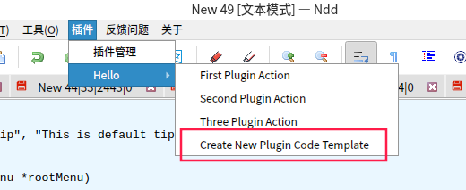
2. 在对话框中填写你的插件名称与类名(纯英文不带空格可以直接使用插件名)
    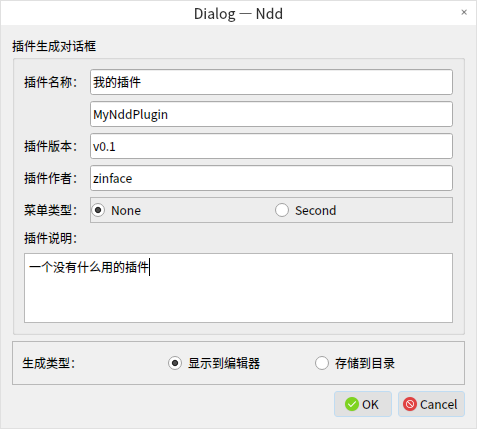
3. 保存(生成)到源码树目录的某个子目录下
    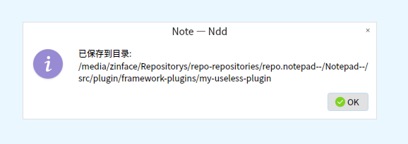
4. 在编辑器中将出现一段cmake的构建说明，粘贴到 src/plugin/CMakeLists.txt 中
    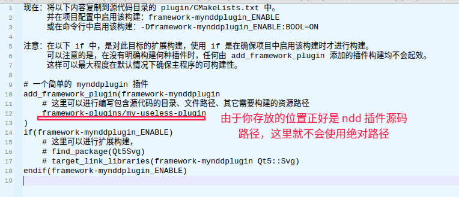
5. 在 Qt Creator 中准备构建这个插件 - 勾选
    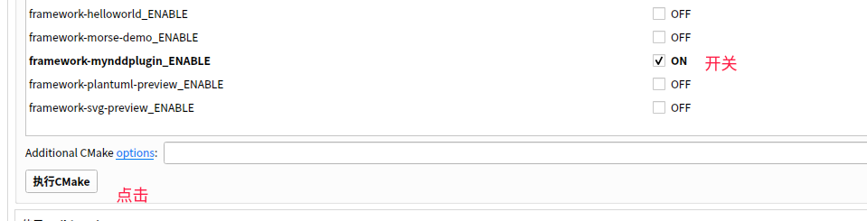
6. 在 Qt Creator 中选中这个目标单独构建它
    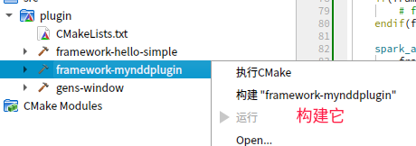
7. 构建完成直接启动已编译过的 Notepad-- 程序
    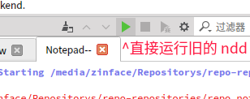
8. 在打开的 Notepad-- 中可以发现插件已经加载了
    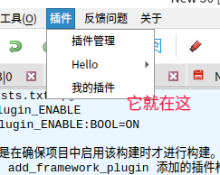
9. 在插件源码中可以发现一级菜单直接触发时执行的内容
    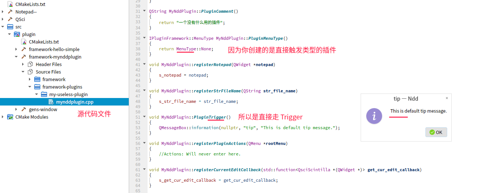
10. 插件：一级菜单和二级菜单的区别
    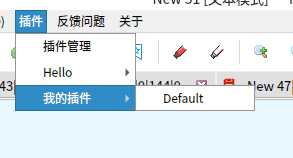
11. 插件二级菜单的入口与逻辑说明
    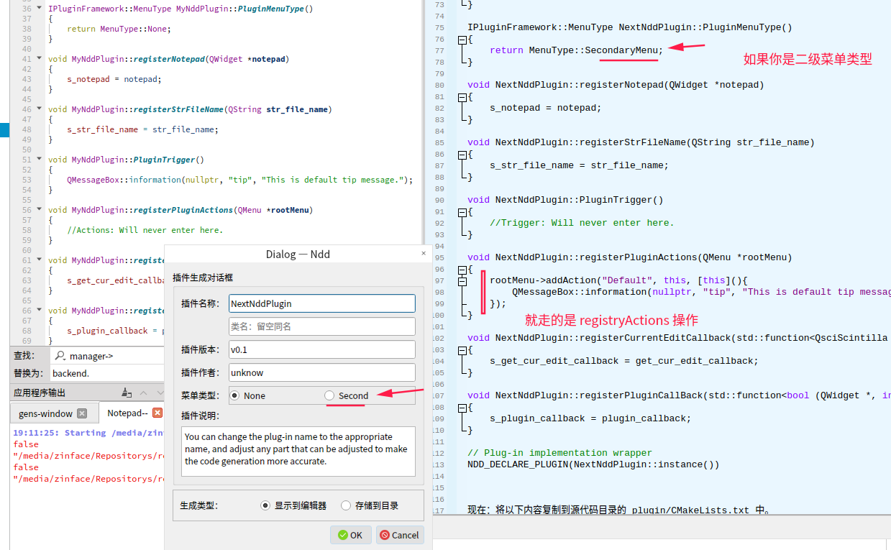
    

- 来自 Notepad-- 新插件诞生流程缩略预览

    ```shell
    # 1. 使用源码树中的 hello-simple 插件提供的功能
    # 2. 在对话框中填写你的插件名称与类名(纯英文不带空格可以直接使用插件名)
    # 3. 保存(生成)到源码树目录的某个子目录下
    # 4. 在编辑器中将出现一段cmake的构建说明，粘贴到 src/plugin/CMakeLists.txt 中
    # 5. 在 Qt Creator 中准备构建这个插件 - 勾选
    # 6. 在 Qt Creator 中选中这个目标单独构建它
    # 7. 构建完成直接启动已编译过的 Notepad-- 程序
    # 8. 在打开的 Notepad-- 中可以发现插件已经加载了
    # 9. 在插件源码中可以发现一级菜单直接触发时执行的内容
    # 10. 插件：一级菜单和二级菜单的区别
    # 11. 插件二级菜单的入口与逻辑说明
    ```

- 来自框架化构建插件的开发后记

    ```shell
    # 1. 一开始走了好多弯路，以前疯狂用宏来定义入口与触发实现，纯 C 风格的一层操作。
    # 2. 后来给它加了层 "标准Qt插件开发" 的壳，诞生出基于某种意义上的框架来实现插件。
    # 3. 开发过几个插件后，发现基于框架的东西基本上都是重复的。
    # 4.为了解决插件的诞生难题，为了不像用 vulkan 一样画个三角形都要写900行框架初始化代码
    #   所以用生成器的概念来创造插件的基础代码。
    ```

### Deprecated: 被废弃的开发说明


> 当前插件开发提供一系列模板

- 有关基于源代码的插件开发描述与 template-plugins 说明

    ```shell
    ...
    template-plugins/
    ├── base-plugin                 # 一个比较原始的插件结构，仅用于参考
    ├── base-widget-plugin          # 一个基于 QWidget 的插件模板
    ├── base-widget-ui-plugin       # 一个基于 QMainWindow 的插件模板
    │   ├── CMakeLists.txt
    │   ├── ndd_plugin_implement.cpp    # 提供一组结构实现
    │   ├── ndd_plugin_implement.h      # 
    │   ├── ndd_plugin_implement.ui     # 提供 ui 文件的插件
    │   └── plugin.cpp                  # 提供 插件信息描述文件
    ├── ... # 添加更多的模板类型
    └── plugin.cpp # 插件宏变化文件，以记录插件宏与接口的历史性变化
    ...
    ```

- 如何开发一个基于源代码树的插件

    ```cmake
    # 复制一份你所想继承的模板，例如: base-widget-ui-plugin

    # 基于 base-widget-ui-plugin 开发一个新的插件 version-update
        # 1. 将文件夹重命名为插件名称
        # 2. 替换内部 CMakeLists.txt 文件的 base-widget-ui-plugin 字符串
        # 3. 在 plugin/CMakeLists.txt 中添加
        add_subdirectory(version-update)

        # 4. 在 version-update/plugin.cpp 中
        NOTEPAD_PLUGIN_METADATA_IDENTIFY("检查更新", "v0.1", "zinface", 
            "Notepad-- 版本检查", "");

        NOTEPAD_PLUGIN_METADATA_IMPLEMENT(NddPluginImplement, false);
        # NddPluginImplement 是来源于 ndd_plugin_implement.h 的类
        # false 表示这个窗口不需要显示
    ```

- 如何开发一个基于源代码树的原生二级菜单显示插件

    ```cmake
    # 复制一份你所想继承的模板，例如: base-secondary-menu-plugin-v1

    # 基于 base-secondary-menu-plugin-v1 开发一个新的插件 external-plugin
        # 1. 将文件夹重命名为插件名称
        # 2. 替换内部 CMakeLists.txt 文件的 base-widget-ui-plugin 字符串
        # 3. 在 plugin/CMakeLists.txt 中添加
        add_subdirectory(external-plugin)

        # 4. 在 external-plugin/plugin.cpp 中
        NOTEPAD_PLUGIN_METADATA_IDENTIFY_V1("外部插件测试", "0.1", "zinface",
            u8"二级扩展的插件支持", "");

        NOTEPAD_PLUGIN_METADATA_IMPLEMENT_V1(NddPluginImplement, false);
        # NddPluginImplement 是来源于 ndd_plugin_implement.h 的类
        # false 表示这个窗口不需要显示
    ```

- 有关 plugin.cpp 宏变化文件

    ```shell
    # 1. 记录了在 cmake-dev 以前的插件宏实现方式
    # 2. 记录了在 cmake-dev 以来的插件宏实现方式
    # 3. 记录了在 cmake-plugins-dev 以来的插件宏实现方式
    # 4. 记录了在 原生支持二级菜单显示 以来的插件宏实现方式
    # ...
    ```


- 写在后面
    
    ```shell
    # 此系列插件继承原有的模式，暂不支持在源代码之外构建
    # 
    # 注意：
        # 由于插件系列统一以 ndd_plugin_implement 为文件名
        # 在编写 ui 文件时，请提前打开此 ui 文件相关的 cpp 文件
        # 或关闭其它不相关的插件源文件，以避免生成槽函数时出现在其它位置

    # 关于在 Windows 中编译插件出现的问题：
        # 1. error C2001: 常量中有换行符
            # 在中文与双引号处添加空格为分隔："中文 "
            # 或在中文结束位置添加英文结束符："中文."

            # 此错误一般来源于 NOTEPAD_PLUGIN_METADATA_IDENTIFY 宏
    ```
